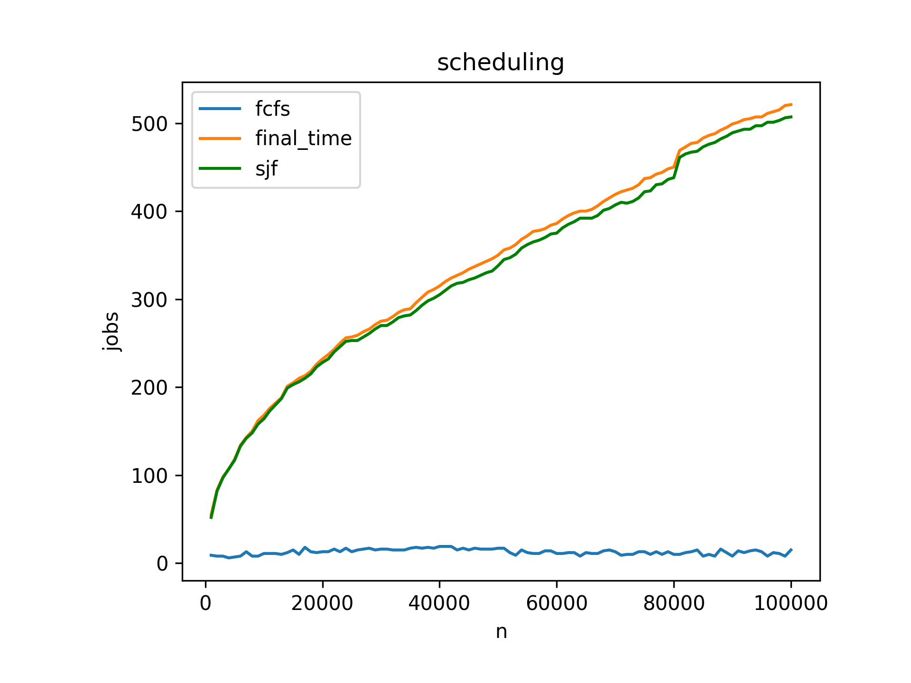
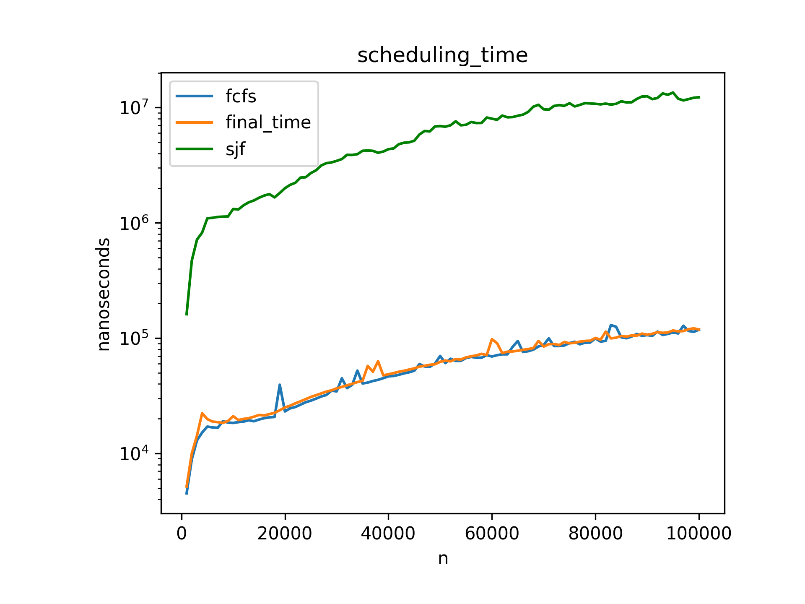

# Activity Selection Problem

This folder contains an implementation of the Activity Selection algorithm, a classic problem in optimization that demonstrates the greedy approach.

## Problem Statement

Given a set of activities, each with a start time and finish time, select the maximum number of non-overlapping activities that can be performed by a single person, assuming that a person can only work on a single activity at a time.

## Implementation Details

- **File**: `activitySelection.cpp`
- **Approach**: Greedy algorithm
- **Data Structure**: 
  - Custom `Activity` struct to store start and finish times
  - Vector of `Activity` objects

## Algorithm Steps

1. Sort all activities in ascending order of finish time
2. Initialize the solution set with the first activity (earliest finishing)
3. Iterate through the remaining activities:
   - If the current activity starts after or at the finish time of the last selected activity, add it to the solution set
   - Otherwise, skip the activity

## Visualization

### Activity Schedule Representation


### Performance Analysis


## Correctness of Greedy Approach

The greedy approach of selecting activities based on earliest finish time is optimal because:
- By selecting the activity with the earliest finish time, we maximize the remaining time available for other activities
- This ensures that we have the opportunity to include as many activities as possible

## Time Complexity

- **Sorting**: O(n log n) where n is the number of activities
- **Activity selection**: O(n)
- **Overall**: O(n log n)

## Space Complexity

- O(n) for storing the activities

## Applications

The Activity Selection Problem has various real-world applications:
- Scheduling classroom or meeting room reservations
- CPU task scheduling
- Transportation and logistics scheduling
- Project management and resource allocation
- Time management for personal tasks

## Example

The implementation includes a sample set of activities:
```
{1, 3}, {2, 5}, {3, 9}, {0, 6}, {5, 7}, {8, 9}
```
Where each pair represents (start_time, finish_time).

The algorithm selects the non-overlapping activities:
```
(1, 3), (5, 7), (8, 9)
```

## Extensions

The basic activity selection problem can be extended to:
- Multiple resources (e.g., multiple meeting rooms)
- Activities with weights or priorities
- Activities with setup time or cleanup time
- Overlapping activities with penalties 