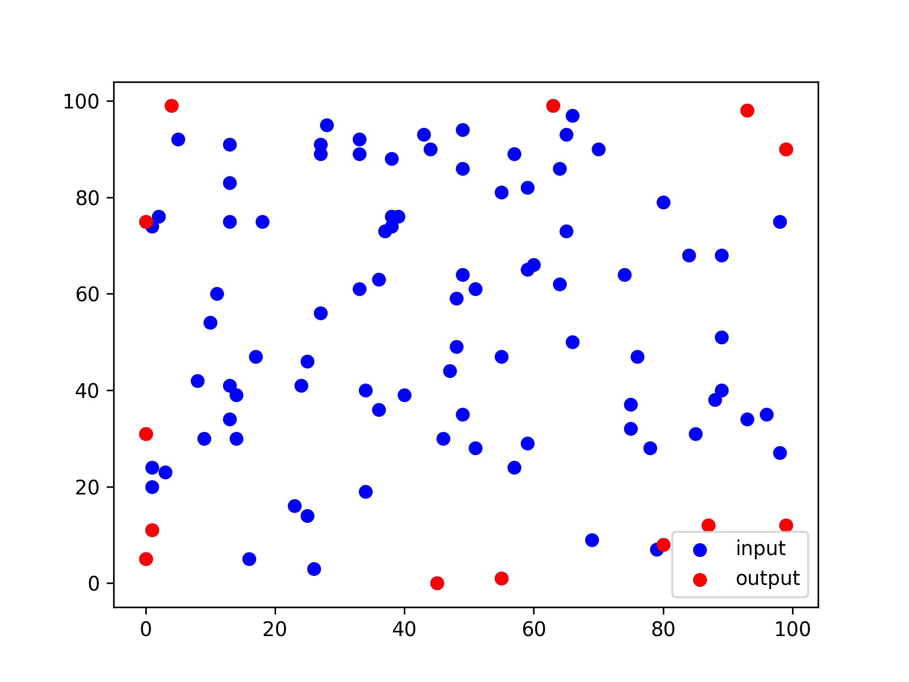

# Convex Polygon Algorithms

This folder contains implementations of algorithms related to convex polygons and computational geometry.

## Quick Hull Algorithm

### Problem Statement
Given a set of points in a 2D plane, find the smallest convex polygon that encloses all the points.

### Implementation Details
- **File**: `convexPolygon.cpp`
- **Approach**: Divide and conquer
- **Algorithm**:
  1. Find the leftmost and rightmost points
  2. The line formed by these two points divides the set into two subsets
  3. The points on the same side of the line cannot be part of the convex hull
  4. Find the point with maximum distance from the line in each subset
  5. Recursively repeat the process for the new lines formed

### Visualization

### Time Complexity
- **Best Case**: O(n log n)
- **Average Case**: O(n log n)
- **Worst Case**: O(n²) if many points are on the hull

### Space Complexity
- O(n) for storing the points and the hull

## Point Inside Triangle Algorithm

### Problem Statement
Determine whether a given point lies inside or outside a triangle defined by three points.

### Implementation Details
- **File**: `pointInsideTriangle.cpp`
- **Approach**: Area-based method
- **Algorithm**:
  1. Calculate the area of the original triangle ABC
  2. Calculate the areas of three triangles formed by point P and two vertices of ABC
  3. If the sum of the three small triangles equals the area of the original triangle, point P is inside

### Time Complexity
- O(1) - constant time operations

### Space Complexity
- O(1) - fixed amount of memory regardless of input size

## Applications

These algorithms have applications in:
- Computer graphics (clipping, collision detection)
- Geographic information systems (GIS)
- Pattern recognition
- Image processing
- Motion planning for robots
- Computer vision

## Usage

### Convex Hull
The program prompts users to enter a set of points and outputs the vertices of the convex hull.

### Point Inside Triangle
The program asks for the coordinates of a triangle and a test point, then determines if the point is inside or outside the triangle. 