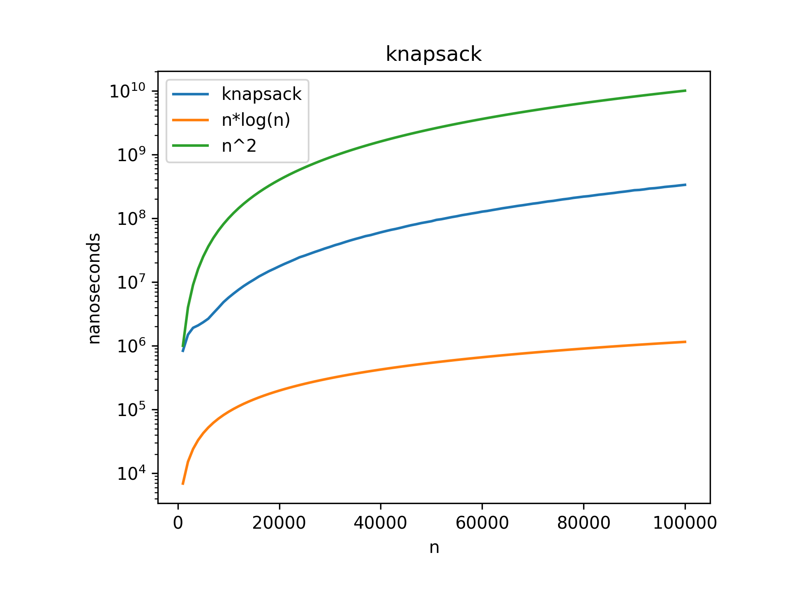

# Fractional Knapsack Algorithm

This folder contains an implementation of the Fractional Knapsack algorithm, a classic optimization problem in computer science and operations research.

## Problem Statement

In the Fractional Knapsack problem:
- We have a set of items, each with a weight and a value
- We have a knapsack with a maximum weight capacity
- We can take fractions of items (unlike 0/1 knapsack where we must take the entire item or none)
- The goal is to maximize the total value of items in the knapsack while keeping the total weight within capacity

## Implementation Details

- **File**: `index.cpp`
- **Approach**: Greedy algorithm
- **Data Structure**: 
  - Custom `Item` struct with value, weight, and value-to-weight ratio
  - Vector of `Item` objects

## Algorithm

1. Calculate the value-to-weight ratio for each item
2. Sort all items by value-to-weight ratio in decreasing order
3. Initialize total value and current weight to 0
4. Iterate through the sorted items:
   - If adding the current item doesn't exceed capacity, add it completely
   - Otherwise, add a fraction of the item to fill the remaining capacity

## Visualization

## Time Complexity

- **Sorting**: O(n log n) where n is the number of items
- **Greedy selection**: O(n)
- **Overall**: O(n log n)

## Space Complexity

- O(n) for storing the items

## Optimality

The Fractional Knapsack problem can be optimally solved using a greedy approach, unlike the 0/1 Knapsack problem which requires dynamic programming for an optimal solution.

## Usage

The program prompts the user for:
1. Number of items
2. Maximum capacity of the knapsack
3. Value and weight for each item

It then outputs the maximum possible value that can be obtained by optimally filling the knapsack. 