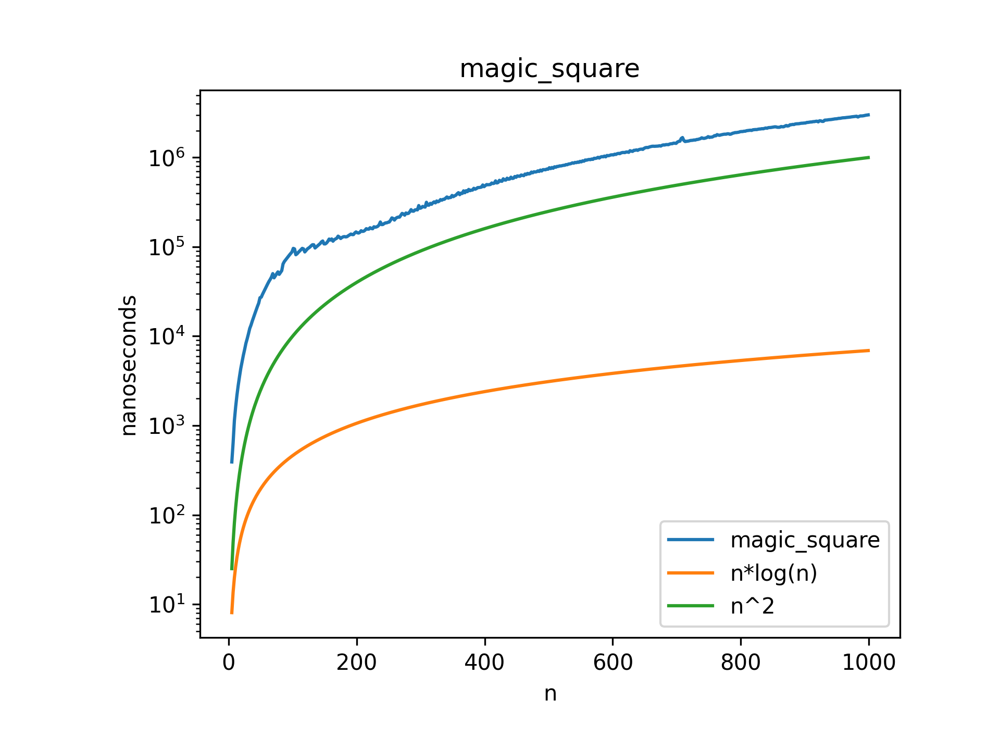

# Magic Square Algorithm

This folder contains an implementation of the Magic Square algorithm, which generates an n×n grid filled with distinct positive integers such that the sum of numbers in each row, column, and diagonal is the same.

## Problem Statement

A magic square of order n is an arrangement of n² numbers (usually distinct integers) in a square, such that the n numbers in all rows, all columns, and both diagonals sum to the same constant.

## Implementation Details

- **File**: `index.cpp`
- **Approach**: Deterministic construction using the Siamese method (De la Loubère method)
- **Constraints**: Works for odd-sized squares (n is odd)

## Algorithm Steps

1. Start with placing 1 in the middle of the top row
2. For each subsequent number i (from 2 to n²):
   - Move one position up and one position left
   - If this position is outside the square, wrap around to the opposite side
   - If the position is already filled, move one position down from the previous position
   - Place the number i in this position

## Visualization

## Time Complexity

- O(n²) where n is the size of the magic square
  - We need to fill n² cells with exactly one operation per cell

## Space Complexity

- O(n²) for storing the n×n magic square

## Usage

The program is set up to:
1. Generate magic squares of various odd sizes (from 5 to 999 with increments of 2)
2. Measure and output the time taken for each size

## Properties of the Generated Magic Square

- The sum of each row, column, and diagonal is the same: n(n²+1)/2
- Contains all integers from 1 to n²
- Only works for odd values of n

## Applications

Magic squares have applications in:
- Recreational mathematics
- Combinatorial design
- Statistical design of experiments
- Digital image processing (magic square transforms)
- Error correction codes

## Performance Analysis

The code includes benchmarking functionality that measures the time required to generate magic squares of different sizes, which can be used to verify the O(n²) time complexity. 