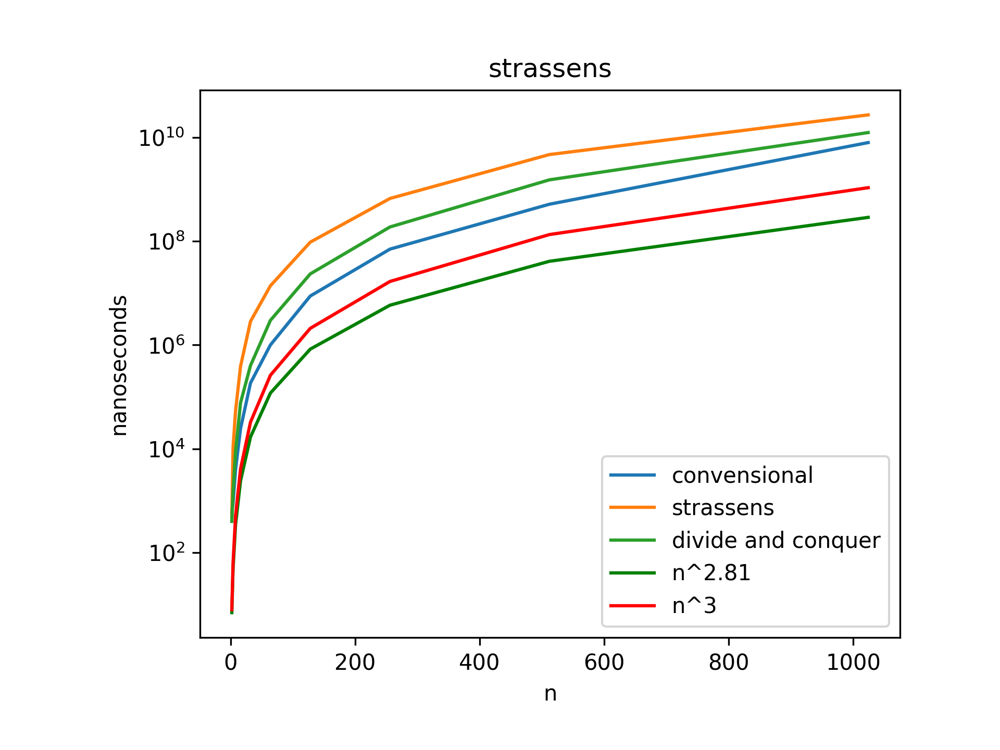

# Matrix Multiplication Algorithms

This folder contains implementations of different matrix multiplication algorithms, from simple to advanced approaches.

## Simple Matrix Multiplication

### Algorithm Overview
The straightforward implementation of matrix multiplication using three nested loops.

### Implementation Details
- **File**: `simpleMethod.cpp`
- **Approach**: Iterative, direct implementation of the mathematical definition
- **Mathematical Formula**: 
  ```
  C[i][j] = Σ (A[i][k] * B[k][j]) for k = 0 to n-1
  ```

### Time Complexity
- O(n³) where n is the dimension of the square matrices

### Space Complexity
- O(n²) for the result matrix

## Divide and Conquer Method

### Algorithm Overview
This approach divides each matrix into four submatrices, performs operations on these smaller matrices, and combines the results.

### Implementation Details
- **File**: `divideAndConquerMethod.cpp`
- **Approach**: Recursive divide and conquer
- **Process**:
  1. Divide each n×n matrix into four n/2×n/2 submatrices:
     - A = [[A11, A12], [A21, A22]]
     - B = [[B11, B12], [B21, B22]]
  2. Recursively compute 8 matrix multiplications:
     - C11 = A11*B11 + A12*B21
     - C12 = A11*B12 + A12*B22
     - C21 = A21*B11 + A22*B21
     - C22 = A21*B12 + A22*B22
  3. Combine these submatrices to form the final product C = [[C11, C12], [C21, C22]]

### Time Complexity
- Recurrence relation: T(n) = 8T(n/2) + O(n²)
- Solving this recurrence: O(n³) - same as the simple method asymptotically
- Involves 8 recursive calls for n/2 sized matrices

### Space Complexity
- O(n²) for storing the matrices
- Additional O(log n) depth for recursive calls

## Strassen's Algorithm

### Algorithm Overview
Strassen's algorithm is an optimized divide and conquer approach that reduces the number of recursive calls from 8 to 7, leading to improved asymptotic complexity.

### Implementation Details
- **File**: `strassenMultiplication.cpp`
- **Approach**: Optimized recursive divide and conquer
- **Process**:
  1. Divide matrices A and B into four n/2×n/2 submatrices
  2. Instead of 8 recursive multiplications, calculate 7 matrix products:
     - P1 = A11 * (B12 - B22)
     - P2 = (A11 + A12) * B22
     - P3 = (A21 + A22) * B11
     - P4 = A22 * (B21 - B11)
     - P5 = (A11 + A22) * (B11 + B22)
     - P6 = (A12 - A22) * (B21 + B22)
     - P7 = (A11 - A21) * (B11 + B12)
  3. Calculate the result matrices:
     - C11 = P5 + P4 - P2 + P6
     - C12 = P1 + P2
     - C21 = P3 + P4
     - C22 = P5 + P1 - P3 - P7
  4. Fall back to standard multiplication for small matrices (optimization)

### Optimization Techniques
- **Threshold Switching**: For matrices smaller than a certain size (64 in this implementation), the algorithm switches to the simple method
- **Memory Management**: Reuses temporary matrices where possible to reduce space overhead
- **In-place Operations**: Some operations are performed in-place to minimize memory allocation

### Visualization



### Time Complexity
- Recurrence relation: T(n) = 7T(n/2) + O(n²)
- Solving this recurrence: O(n^log₂7) ≈ O(n^2.81)
- Significantly better than O(n³) for large matrices

### Space Complexity
- O(n²) for storing the matrices
- Additional O(n²) for temporary matrices during computation
- Total: O(n²)

## Comparative Analysis

| Algorithm | Time Complexity | Space Complexity | Best Use Case |
|-----------|----------------|-----------------|---------------|
| Simple | O(n³) | O(n²) | Small matrices, straightforward implementation |
| Divide & Conquer | O(n³) | O(n²) | Educational purposes, base for advanced methods |
| Strassen's | O(n^2.81) | O(n²) | Large matrices (n > 64) |

## Usage Notes

- All implementations handle matrices of any size
- For non-power-of-2 sized matrices, padding is applied for divide and conquer methods
- A threshold is implemented in Strassen's algorithm to switch to simple multiplication for small matrices, optimizing performance

## Practical Considerations

- Strassen's algorithm, despite its better asymptotic complexity, often performs worse than optimized simple multiplication for smaller matrices due to:
  - Higher constant factors in the time complexity
  - Worse cache performance due to non-contiguous memory access patterns
  - More complex implementation with higher overhead

- Modern implementations often use:
  - Cache-aware blocking techniques
  - SIMD instructions for parallelism
  - Hybrid approaches that combine multiple algorithms

## Future Extensions

Potential improvements to the current implementations could include:
- Parallel versions using OpenMP or pthreads
- Implementing Coppersmith-Winograd algorithm (O(n^2.376)) or more recent algorithms
- Cache-optimized versions with explicit blocking 