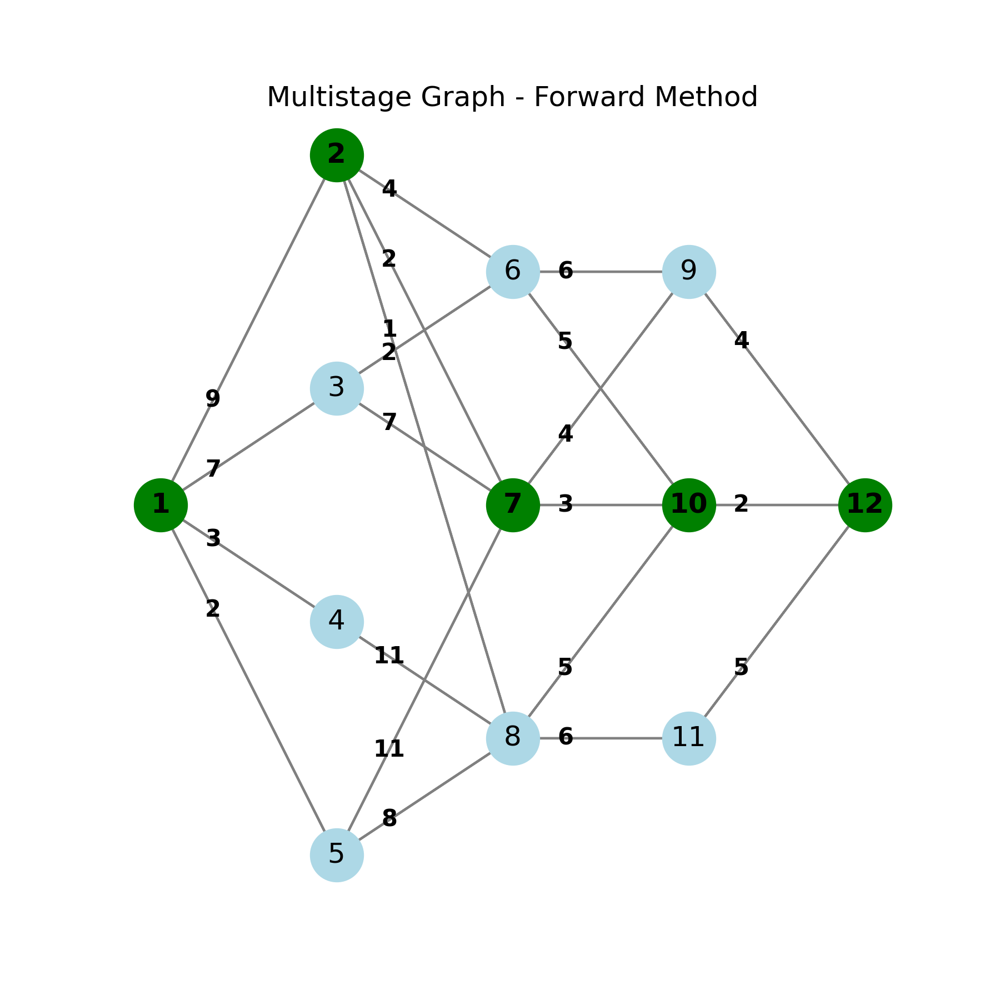
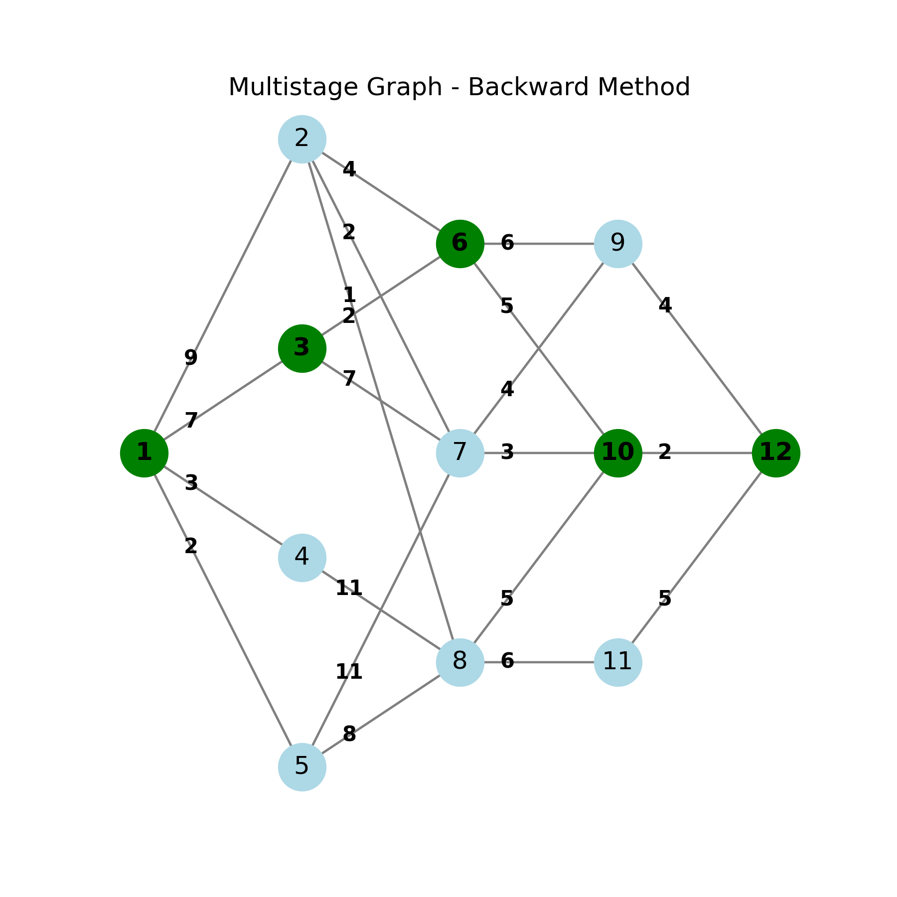

# Multistage Graphs

This folder contains implementations of algorithms for solving the multistage graph problem using dynamic programming.

## Problem Statement

A multistage graph is a directed graph where:
- Vertices are divided into k stages (or levels)
- Edges connect vertices in consecutive stages only (from stage i to stage i+1)
- There is a single source vertex (stage 1) and a single sink vertex (stage k)
- The goal is to find the shortest path from source to sink

## Forward Approach Implementation

### Algorithm Overview
The forward approach solves the multistage graph problem by computing the minimum cost path from the source to each vertex.

### Implementation Details
- **File**: `forwardApproach.cpp`
- **Approach**: Dynamic Programming (Forward)
- **Data Structures**:
  - Adjacency matrix for graph representation
  - Arrays for cost, path, and predecessor tracking

### Algorithm Steps
1. Initialize cost array with infinity for all vertices except source (cost[0] = 0)
2. For each vertex i in topological order:
   - For each adjacent vertex j:
     - Update cost[j] if cost[i] + graph[i][j] is smaller than current cost[j]
     - Update predecessor of j
3. Construct the path from the predecessor information

### Visualization

#### Forward Approach


#### Backward Approach (Alternative)


### Time Complexity
- O(V²) where V is the number of vertices
  - Exactly one pass through all vertices
  - For each vertex, examine all possible edges to next stage

### Space Complexity
- O(V) for the cost, path, and predecessor arrays
- O(V²) for the adjacency matrix

## Applications

Multistage graph problems appear in various applications:
- Project management and scheduling
- Network routing
- Resource allocation
- Assembly line optimization
- Sequential decision making

## Example Output

```
shortest path cost: 9
path: 0 -> 2 -> 5 -> 7
```

This indicates:
- The minimum cost path from source to sink has a total cost of 9
- The path traverses vertices 0 (source), 2, 5, and 7 (sink)

## Usage

The implementation includes a predefined multistage graph example with 8 vertices and 4 stages. The program outputs the minimum cost path and prints the sequence of vertices in the optimal path. 