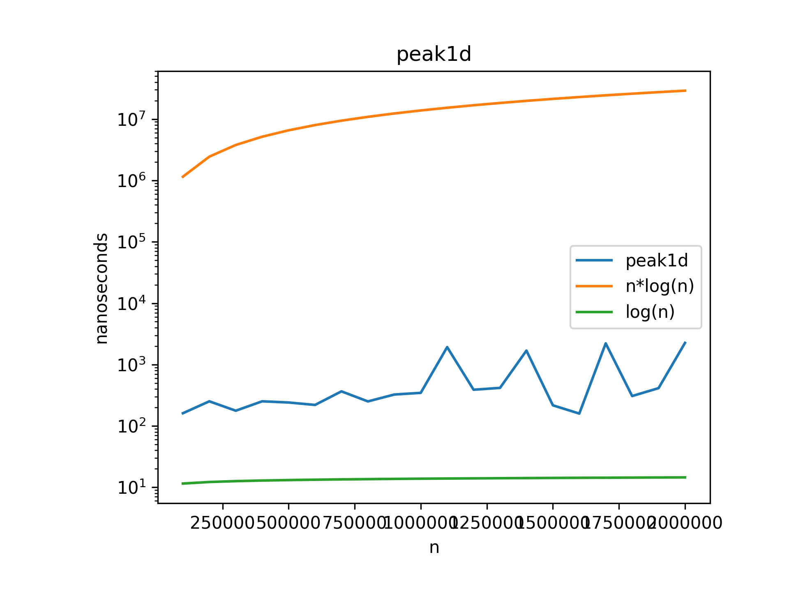
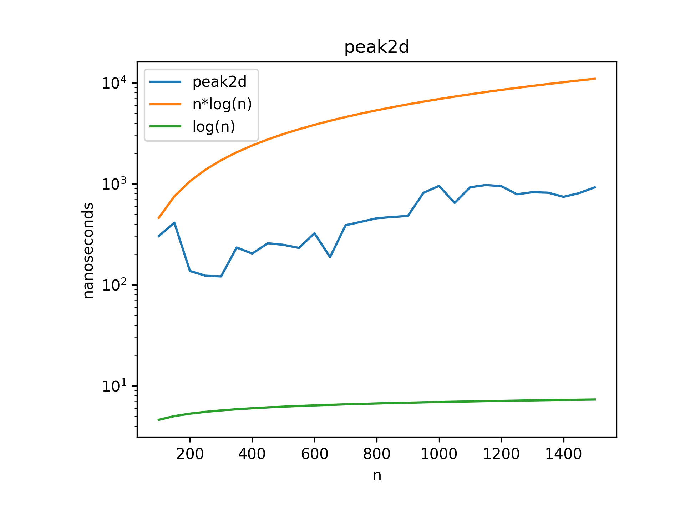

# Peak Finding Algorithms

This folder contains implementations of peak finding algorithms in both 1D and 2D arrays using divide and conquer techniques.

## 1D Peak Finding Algorithm

A peak element in a 1D array is an element that is greater than or equal to its neighbors.

### Implementation Details
- **File**: `1d_Peak.cpp`
- **Approach**: Binary search / Divide and conquer
- **Algorithm**:
  1. Find the middle element of the array
  2. If the middle element is a peak (greater than or equal to its neighbors), return it
  3. If the left neighbor is greater, search in the left half
  4. If the right neighbor is greater, search in the right half

### Visualization

### Time Complexity
- **Best Case**: O(1) - when the first middle element is a peak
- **Average Case**: O(log n)
- **Worst Case**: O(log n)

### Space Complexity
- O(log n) - recursive call stack

## 2D Peak Finding Algorithm

A peak element in a 2D matrix is an element that is greater than or equal to its adjacent neighbors (up, down, left, right).

### Implementation Details
- **File**: `2d_Peak.cpp`
- **Approach**: Divide and conquer
- **Algorithm**:
  1. Find the middle column
  2. Find the maximum element in this column
  3. Check if this element is a peak (greater than or equal to its left and right neighbors)
  4. If it's a peak, return it
  5. Otherwise, recursively search in the half where the greater neighbor is located

### Visualization

### Time Complexity
- **Overall**: O(m log n) where m is the number of rows and n is the number of columns
  - Finding the maximum in a column: O(m)
  - Binary search on columns: O(log n)

### Space Complexity
- O(log n) - recursive call stack

## Usage Example
Both implementations include a main function demonstrating how to use the algorithms with sample inputs and how to interpret the outputs. 