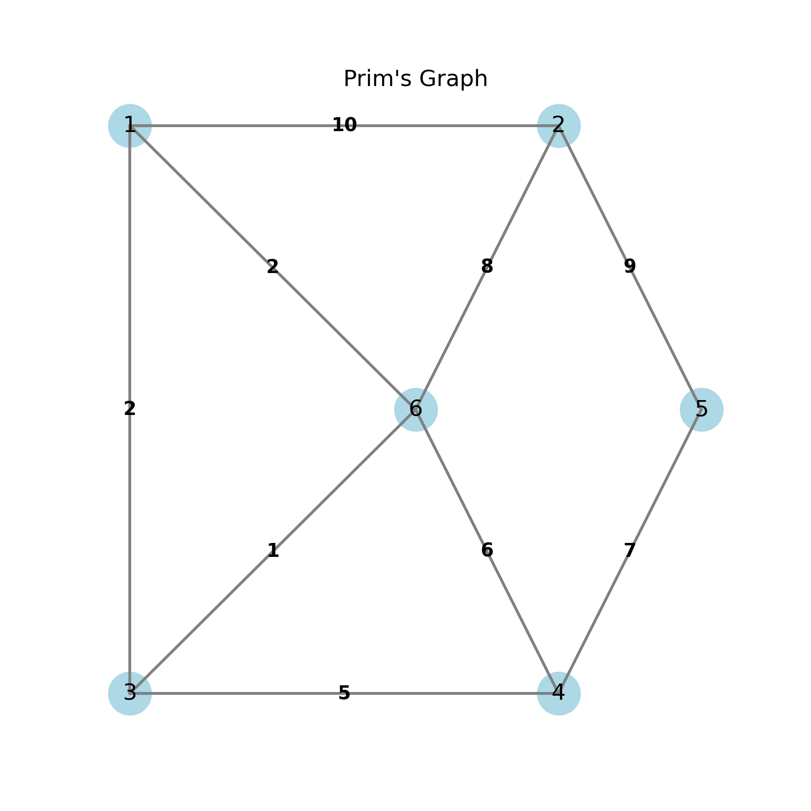
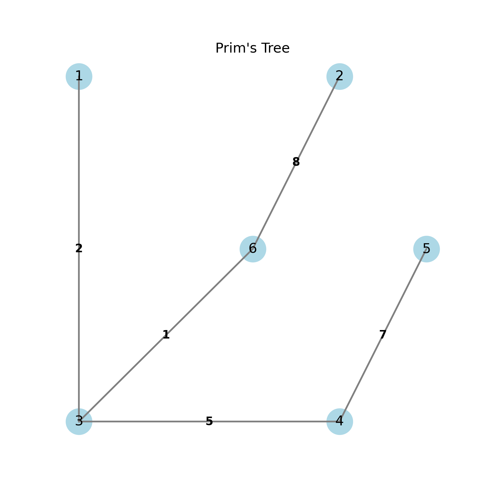

# Prim's Algorithm

This folder contains an implementation of Prim's algorithm, a greedy algorithm that finds a minimum spanning tree for a weighted undirected graph.

## Problem Statement

Given a connected, undirected graph with weighted edges, find a subset of the edges that forms a tree that includes every vertex, where the total weight of all the edges in the tree is minimized.

## Implementation Details

- **File**: `primsAlgo.cpp`
- **Approach**: Greedy algorithm
- **Data Structures**:
  - Adjacency matrix for graph representation
  - Arrays for storing key values, MST vertices, and path information

## Algorithm

1. Initialize all vertices as not yet included in MST
2. Assign a key value of infinity to all vertices except the first one (which gets a value of 0)
3. While MST doesn't include all vertices:
   - Pick the vertex with the minimum key value that is not yet included in MST
   - Include this vertex in MST
   - Update key values of adjacent vertices:
     - If the edge weight is less than the current key value, update the key and parent

## Visualization

### Original Graph


### Minimum Spanning Tree


## Time Complexity

- **Finding the minimum key**: O(V) where V is the number of vertices
- **Main loop iterations**: O(V)
- **Overall**: O(V²)

Note: This implementation using an adjacency matrix has a time complexity of O(V²). Using adjacency list representation with a priority queue (min-heap) would result in O(E log V) time complexity, which is more efficient for sparse graphs.

## Space Complexity

- **Adjacency Matrix**: O(V²)
- **Key, Path, and Visited arrays**: O(V)
- **Overall**: O(V²)

## Applications

Prim's algorithm is used in various applications including:
- Network design (e.g., laying cables, designing computer networks)
- Approximation algorithms for NP-hard problems
- Circuit design
- Transportation networks
- Cluster analysis

## Example Output

The implementation outputs the edges of the minimum spanning tree along with their weights.

```
edge    weight
0 - 1   2
1 - 2   3
0 - 3   6
1 - 4   5
```

This represents a minimum spanning tree with a total weight of 16. 