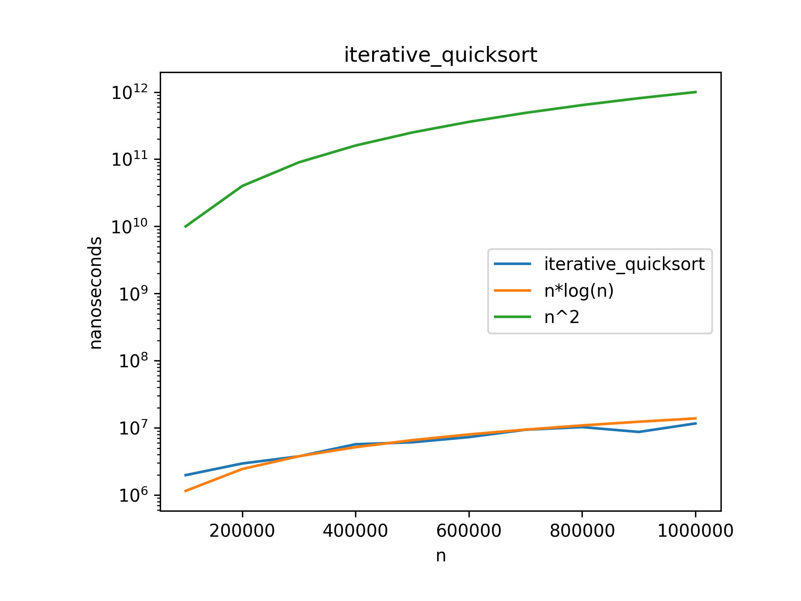
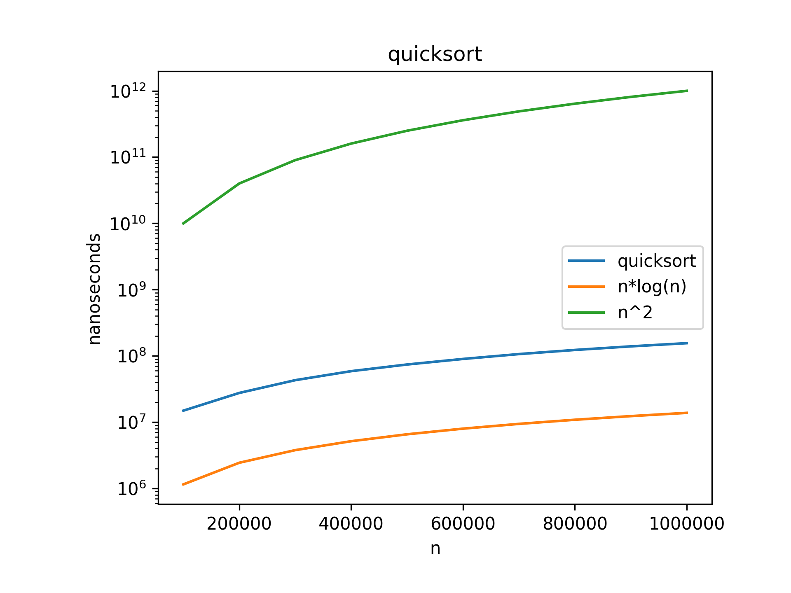
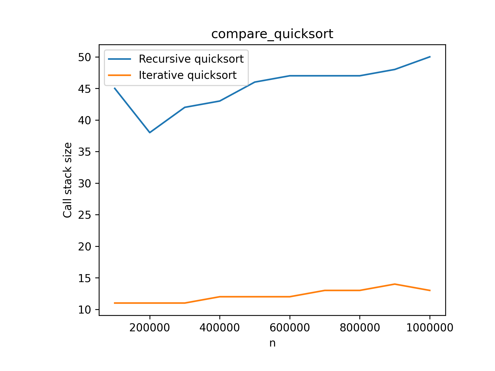

# Sorting Algorithms

This folder contains implementations of various sorting algorithms, with a focus on iterative QuickSort.

## Iterative QuickSort

### Algorithm Overview
QuickSort is a divide-and-conquer sorting algorithm that works by selecting a 'pivot' element from the array and partitioning the other elements around it.

The iterative implementation avoids recursion by using a stack to store the subarrays that need to be sorted.

### Implementation Details
- **File**: `iterativeQuickSort.cpp`
- **Data Structures**:
  - Stack to manage partitions instead of recursion
  - Pairs to store the subarray bounds

### Algorithm Steps
1. Push the entire array (bounds) onto the stack
2. While the stack is not empty:
   - Pop a subarray from the stack
   - Partition the subarray around a pivot
   - Push the resulting subarrays onto the stack if they contain more than one element

### Partitioning Strategy
The implementation uses the last element as the pivot and divides the array into elements less than or equal to the pivot and elements greater than the pivot.

### Visualizations

#### Iterative QuickSort Performance

#### QuickSort Execution

#### Comparison with Other Implementations

### Time Complexity
- **Best Case**: O(n log n) - when partitions are balanced
- **Average Case**: O(n log n)
- **Worst Case**: O(n²) - when partitions are highly unbalanced (e.g., already sorted array)

### Space Complexity
- O(log n) in the best case for the stack
- O(n) in the worst case

## Advantages of Iterative Implementation
- Avoids recursive call overhead
- Prevents stack overflow for large arrays
- Often more efficient in practice due to better memory locality

## Applications
- General-purpose sorting
- Database systems
- Data preprocessing for algorithms
- Implemented in standard libraries of many programming languages

## Usage
The program includes a simple test case demonstrating how to use the iterative QuickSort to sort an integer array. 